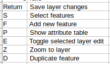

# SenseHawk QC Plugin (v1)

1. ### _Workspace setup_
   - User login and logout: 
     - Enter SenseHawk user email address and password and click login.
     
     - Closing the plugin will logout the user automatically.
   
   - Loading project:
      - Enter the project UID of the project you want to load. Select the type of SenseHawk project it is (Therm/Terra) and click on Load Project.
        

      -  Once the load is complete, the geojson and orthotiles should be visible like this,
     
      - Depending on the type of SenseHawk project loaded, the Tools window of the plugin will be displayed.
     
     

2. ### _QC_
   - QGIS features:
     - You can use all the functionality of QGIS to manipulate the geojson features.
   - Custom QGIS features (Custom keyboard shortcuts):
     - There are a few custom functions implemented in the plugin that can be accessed by keyboard shortcuts.
     
        
     - Terra/Therm shortcut csv files can be found by following `Settings > User Profiles > Open Active Profile Folder > python > plugins > sensehawk_qc > windows`. The `windows` folder will contain the `terra_keyboard_shortcuts.csv` and `therm_keyboard_shortcuts.csv`; and the keys can be changed by altering these csv files.
     - Changing feature type: Feature type can be changed by selecting the feature (or features) and pressing the relevant keyboard shortcut for that particular feature type. If not feature is selected, the feature type of the feature that was last added before save will be changed.
     - Duplicating feature: `D` is the default keyboard shortcut to activate the duplicate tool. This tool is similar to `copy and move` feature in QGIS except the feature type of the selected feature can be changed on the fly.
   
3. ### _Therm Tools_
    - AI assisted detection: Once a therm project is loaded, clicking the detect button will queue the request. You will receive a notification email when the detection server starts processing your request. Once the request is processed, you will receive an email notification along with the detection geojson attachment.
   
4. ### _Terra Tools_
    - Clipping orthos: 
      - First you need to create clip boundaries by making a new polygon, providing the `name` property and changing the feature type to `clip_boundary`. Default keyboard shortcut for `clip_boundary` is `C`.
      - Then `save` the project and click 'Clip Raster'. Your request will be queued and you will receive an email notification once clipping is complete.
      - New projects are created for the clipped raster and are automatically added to the SenseHawk group of the parent project from which `Clip Raster` was called. The `name` property of each `clip_boundary` feature will represent the name of the newly created project.
    - Creating custom AI models:
      - All components that need to be modeled must be grouped under `Components` feature group in Terra.
      
        
      - Then you need to create a training boundary that contains the training dataset. Training boundary is created by making a polygon feature and changing the feature type to `train_boundary` (default key is `T`). Bigger training boundary equals better but slower detections. You can have multiple training boundaries. 
      - Mark all components inside the training boundaries.
      - Click `Request Model` in the tools window, select the appropriate Machine Learning service (segmentation/detection) for each of the components. Click on `Train` to queue your request. You will receive email notifications once your request is taken up by the server for processing and when the processing is complete. 
      
    - Using the created custom AI models:
      - Once the model is trained, it will be available for all the projects in the same SenseHawk project group for AI assisted detections.
      - You can see all the models available in a SenseHawk project group by using `Load Models` button in the Terra tools window. Select the required model from the dropdown and click on `Detect` to queue your detection request. You will receive email notifications on start and end of the detection process. The detected geojsons are automatically saved in SenseHawk platform and available for QC.
    - Approval:
      - Once the QC is completed over the AI detected features, clicking the `Approve` button will generate the feature count and percentage feature value for all components inside `Table` features. 

5. Troubleshooting and raising issues:
   - You can enable logs using `View > Panels > Log Messages`. `SenseHawk QC` tab will show all logs from the plugin.
   - Issues can be raised on GitHub using `Plugins > Manage and Install Plugins`, searching for `SenseHawk QC` and clicking on `bug tracker`.
   
   